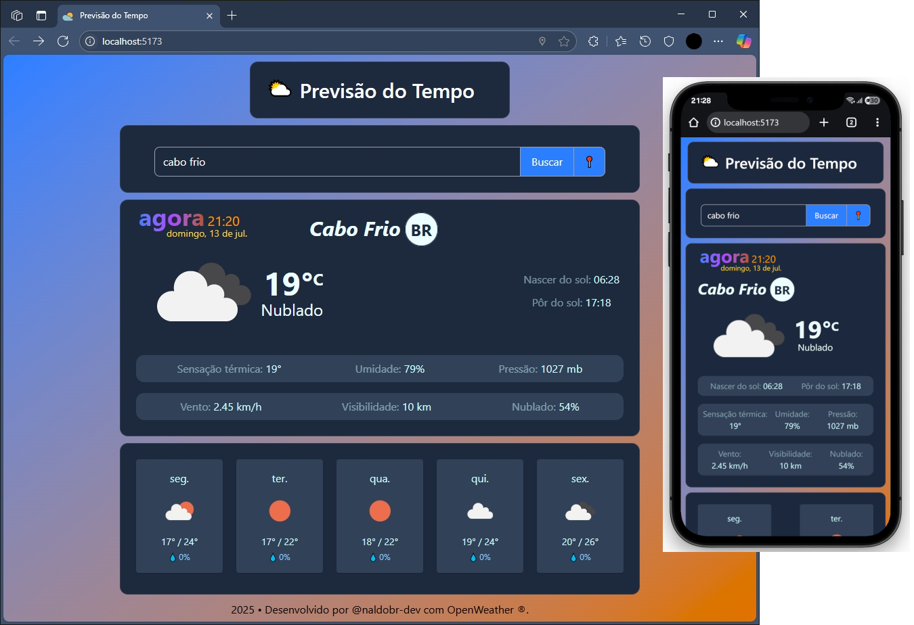

# 🌦️ Previsão do Tempo

Aplicativo simples e responsivo de previsão do tempo em tempo real, desenvolvido com **Vite + React + TypeScript + Tailwind CSS**, utilizando a API da [OpenWeatherMap](https://openweathermap.org/).

---

## ✨ Funcionalidades

- Consulta automática da previsão com base na **localização do usuário**.
- Pesquisa manual do clima por **nome da cidade**.
- Exibição do **clima atual** com ícone, temperatura, sensação térmica, umidade, visibilidade, vento, nuvens e mais.
- Cards com **previsão dos próximos dias**.
- Suporte a **modo escuro** (dark mode).
- Totalmente responsivo para dispositivos móveis.

---

## 🧱 Tecnologias Utilizadas

- [Vite](https://vitejs.dev/) – build tool moderno e rápido
- [React](https://reactjs.org/)
- [TypeScript](https://www.typescriptlang.org/)
- [Tailwind CSS](https://tailwindcss.com/)
- [Axios](https://axios-http.com/) – requisições HTTP
- [OpenWeatherMap API](https://openweathermap.org/api) – dados meteorológicos

---

## 🚀 Como executar localmente

1. **Clone o repositório**
```bash
git clone https://github.com/naldobr-dev/weather-app.git
cd weather-app
````

2. **Instale as dependências**

```bash
npm install
```

3. **Configure a chave da API**
   Crie um arquivo `.env` na raiz do projeto e adicione sua chave da API da OpenWeatherMap:

```env
VITE_WEATHER_API_KEY=sua_chave_aqui
```

> 🔑 Você pode obter uma chave gratuita em: [https://openweathermap.org/api](https://openweathermap.org/api)

4. **Execute o app**

```bash
npm run dev
```

---

## 📁 Estrutura de Pastas

```
src/
├── components/         # Componentes visuais reutilizáveis
│   ├── WeatherCard.tsx
│   └── ForecastCards.tsx
├── services/           # Integração com APIs externas
│   └── weatherApi.ts
├── types/              # Tipagens do TypeScript
│   └── types.ts
└── App.tsx             # Componente principal
```

---

## 📸 Capturas de Tela

> 

---

## 📌 Melhorias Futuras

* Salvar histórico de pesquisas
* Favoritos
* Alertas meteorológicos
* PWA (instalável)
* Localização com fallback manual

---

## 📄 Licença

Este projeto está licenciado sob a [MIT License](LICENSE).

---

## 🤝 Contribuições

Contribuições são bem-vindas! Sinta-se à vontade para abrir issues, enviar pull requests ou deixar feedbacks.

---

## 👨‍💻 Autor

Desenvolvido com dedicação por [@naldobr-dev](https://github.com/naldobr-dev) 💙

